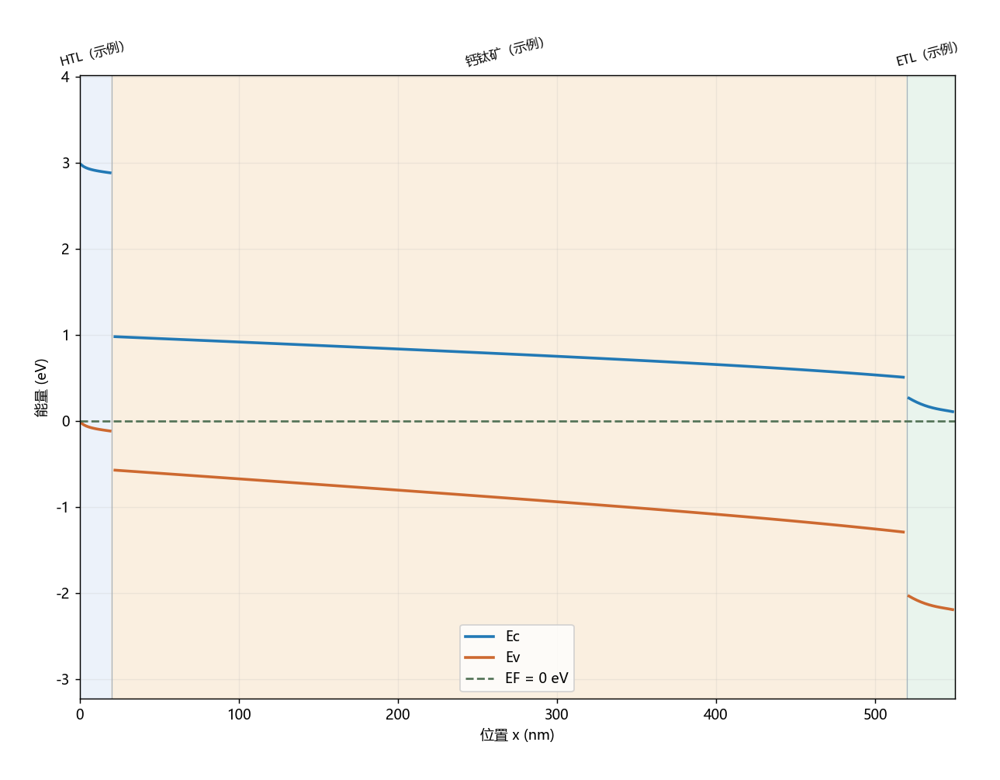

# 钙钛矿能带小工具

Python 桌面工具：编辑异质结材料参数，查看真空参考能级排列和自洽热平衡能带，支持逐层渐变带隙与渐变掺杂。

双击 `start.bat`，或执行 `python app.py`。依赖：`pip install -r requirements.txt`。

左侧编辑层参数，停止输入 0.6 秒后自动刷新。支持层的增删排序、参数 JSON 保存/读取、参数与曲线 CSV 导出、PNG/SVG 图片导出、前后方案对照。数值可输入科学计数法，例如 `1e16`。

## 渐变带隙与渐变掺杂

选择材料层 → 打开「渐变设置」页签 → 选择模式并填写右侧终点。起点来自「基本参数」中的 Eg、Nd、Na，方向始终是当前层的左侧到右侧。均匀模式忽略终点。

- 带隙：均匀或线性。例如钙钛矿层左端 Eg=1.55 eV，右端 Eg=1.8 eV。
- 施主/受主：各自独立选择均匀、线性、对数。例如 Na 从 1e14 渐变至 1e17 cm⁻³。对数渐变要求两端严格大于零；含零浓度请用线性。
- 导带分配比例 α：0 保持电子亲和能不变（只改变真空参考价带），1 保持真空参考价带不变（只改变导带），0.5 均分。它是用户指定的带边模型，并不是仅由 Eg 能确定的材料属性。

若 t 为层内归一化位置，线性值为 A(t)=A左+(A右-A左)t；对数浓度为 exp[(1-t)ln A左+t ln A右]。
电子亲和能按 χ(t)=χ左-α[Eg(t)-Eg左] 变化。在平衡态下，静电势会进一步自洽调整两条带边。掺杂渐变只改变平衡态能带，不改变真空参考排列。

新 JSON 项目使用版本 2，同时兼容旧版版本 1（默认均匀）。参数 CSV 包含渐变模式、终点、分配比例；曲线 CSV 包含沿深度的 Eg、χ、Nd、Na。平衡态曲线采样于网格中心，因此最外采样点不是层的几何端点。

运行 `python -m unittest discover -s band_tool -p test_gradients.py`（在上级目录）可检查渐变模型与均匀极限。

两种模式：
- 真空参考能级排列：Ec=-χ，Ev=-χ-Eg，真空能级为 0。
- 热平衡弯曲能带：一维有限体积泊松-玻尔兹曼求解，EF=0；Ec=-χ-φ，Ev=Ec-Eg。界面网格对齐，用串联介电电阻计算面通量。左右边界 φ=-W，W 为相应电极功函数。假定浅掺杂完全电离。

示例材料和参数仅用于演示，不能作为具体配方的测量结果。温度改变统计分布，材料本身的带隙、态密度等仍按输入值使用，不自动加入温度依赖。

迁移率及 SRH 寿命只保存在参数集中，不影响本工具的热平衡静电求解。没有光照、外加偏压、离子、陷阱电荷、界面偶极、界面复合或电流求解。因此不能预测效率/J–V，不能唯一反推全部参数，也不是完整 SCAPS/SIMsalabim 的替代品。高载流子浓度时玻尔兹曼近似有限，程序会提示。

曲线的能量零点随模式变化，不应跨模式直接比较。电势为上述 EF 参考下的模型电势。参数 CSV 使用 cm 系单位（见表头）；求解器内部使用 SI。JSON 项目同时保存温度、功函数和模式；用于复现计算时应一并保留。导出不是 SCAPS 原生输入格式。

可在后续版本接入 SIMsalabim 处理工作态输运、光生复合以及带先验约束的反演。
