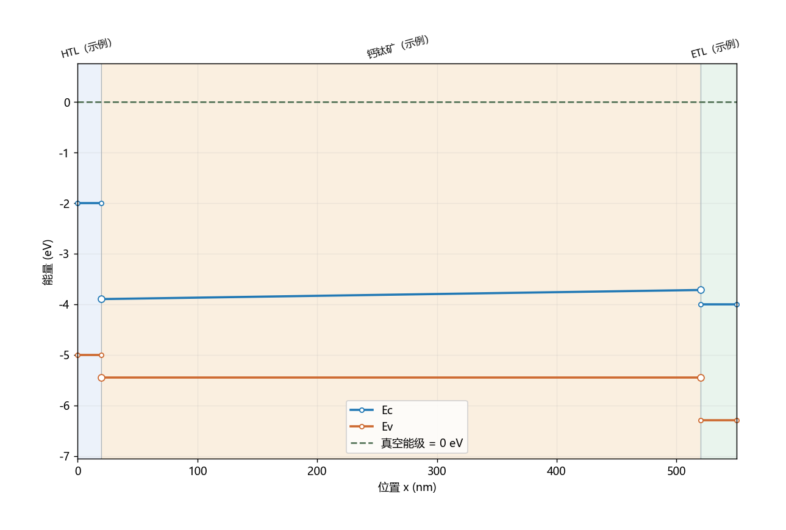

# 钙钛矿能带小工具

Python 桌面工具：编辑异质结材料参数，查看真空参考能级排列和自洽热平衡能带，支持逐层渐变带隙、渐变掺杂和鼠标拖动能带。

双击 `start.bat`，或执行 `python app.py`。依赖：`pip install -r requirements.txt`。

## 鼠标拖动能带

勾选图上方「鼠标拖动能带」，关闭工具栏的缩放/平移模式：

- **拖动蓝色 Ec 或橙色 Ev 曲线中间**：上下移动该层整条带边。
- **拖动左右端点圆点**：只调整该侧材料带边，形成或改变沿厚度方向的渐变。
- 拖动时自动选中材料层，实时更新左侧的 Eg、χ 和右侧终点；图上方也显示左右端点值。
- **松开鼠标**：应用参数并重算；**Esc**：取消本次拖动；**撤销拖动**：恢复上一次拖动前参数，可连续撤销。手动修改参数或层结构会清空撤销记录。

拖动会自动切换电子亲和能到「独立端点」模式：χ(t)=χ左+(χ右-χ左)t，此时导带分配比例 α 不参与计算。Eg(t) 与 χ(t) 独立描述两条带边，避免强制用单一 α 表达任意拖动。原有「随带隙分配」模式仍保留，可在渐变设置中选择。

映射规则按真空参考定义：Ec=-χ，Ev=-χ-Eg。拖 Ec 会同步改变 χ 和 Eg，保持 Ev 的真空参考位置；拖 Ev 会改变 Eg，保持 χ。掺杂、介电常数、态密度、迁移率和寿命不会由拖动反推。

在**真空参考排列**中，最终带边与拖动目标一致。在**热平衡模式**中，拖动期间暂固定原静电势以预览材料参数变化，松开后重新自洽求解；电势重新分布可能使两条带边都变化，最终曲线不保证经过鼠标指定位置。这不是对平衡能带的唯一参数反演。

带隙不能小于或等于零，电子亲和能不能小于零；越界时保留最近有效预览。若松开后无法收敛，会恢复拖动前的参数和有效曲线。

左侧编辑层参数，停止输入 0.6 秒后自动刷新。支持层的增删排序、参数 JSON 保存/读取、参数与曲线 CSV 导出、PNG/SVG 图片导出、前后方案对照。数值可输入科学计数法，例如 `1e16`。

## 渐变带隙与渐变掺杂

选择材料层 → 打开「渐变设置」页签 → 选择模式并填写右侧终点。起点来自「基本参数」中的 Eg、Nd、Na，方向始终是当前层的左侧到右侧。均匀模式忽略终点。

- 带隙：均匀或线性。例如钙钛矿层左端 Eg=1.55 eV，右端 Eg=1.8 eV。
- 施主/受主：各自独立选择均匀、线性、对数。例如 Na 从 1e14 渐变至 1e17 cm⁻³。对数渐变要求两端严格大于零；含零浓度请用线性。
- 导带分配比例 α：0 保持电子亲和能不变（只改变真空参考价带），1 保持真空参考价带不变（只改变导带），0.5 均分。它是用户指定的带边模型，并不是仅由 Eg 能确定的材料属性。

若 t 为层内归一化位置，线性值为 A(t)=A左+(A右-A左)t；对数浓度为 exp[(1-t)ln A左+t ln A右]。
电子亲和能按 χ(t)=χ左-α[Eg(t)-Eg左] 变化。在平衡态下，静电势会进一步自洽调整两条带边。掺杂渐变只改变平衡态能带，不改变真空参考排列。

新 JSON 项目使用版本 3，同时兼容版本 1、2；旧项目按原有带隙分配模型读取。参数 CSV 包含渐变模式、终点、分配比例、电子亲和能模式和独立 χ 终点；曲线 CSV 包含沿深度的 Eg、χ、Nd、Na。平衡态导出曲线采样于网格中心，绘图另外补上几何端点，便于精确编辑材料两侧。

在项目目录运行 `python -m unittest discover -p "test_*.py"` 可检查渐变模型、拖动映射、均匀极限、鼠标交互、取消/撤销、求解失败恢复和保存导出。界面测试会短暂打开 Tk 窗口。

两种模式：
- 真空参考能级排列：Ec=-χ，Ev=-χ-Eg，真空能级为 0。
- 热平衡弯曲能带：一维有限体积泊松-玻尔兹曼求解，EF=0；Ec=-χ-φ，Ev=Ec-Eg。界面网格对齐，用串联介电电阻计算面通量。左右边界 φ=-W，W 为相应电极功函数。假定浅掺杂完全电离。

示例材料和参数仅用于演示，不能作为具体配方的测量结果。温度改变统计分布，材料本身的带隙、态密度等仍按输入值使用，不自动加入温度依赖。

迁移率及 SRH 寿命只保存在参数集中，不影响本工具的热平衡静电求解。没有光照、外加偏压、离子、陷阱电荷、界面偶极、界面复合或电流求解。因此不能预测效率/J–V，不能唯一反推全部参数，也不是完整 SCAPS/SIMsalabim 的替代品。高载流子浓度时玻尔兹曼近似有限，程序会提示。

曲线的能量零点随模式变化，不应跨模式直接比较。电势为上述 EF 参考下的模型电势。参数 CSV 使用 cm 系单位（见表头）；求解器内部使用 SI。JSON 项目同时保存温度、功函数和模式；用于复现计算时应一并保留。导出不是 SCAPS 原生输入格式。

可在后续版本接入 SIMsalabim 处理工作态输运、光生复合以及带先验约束的反演。
